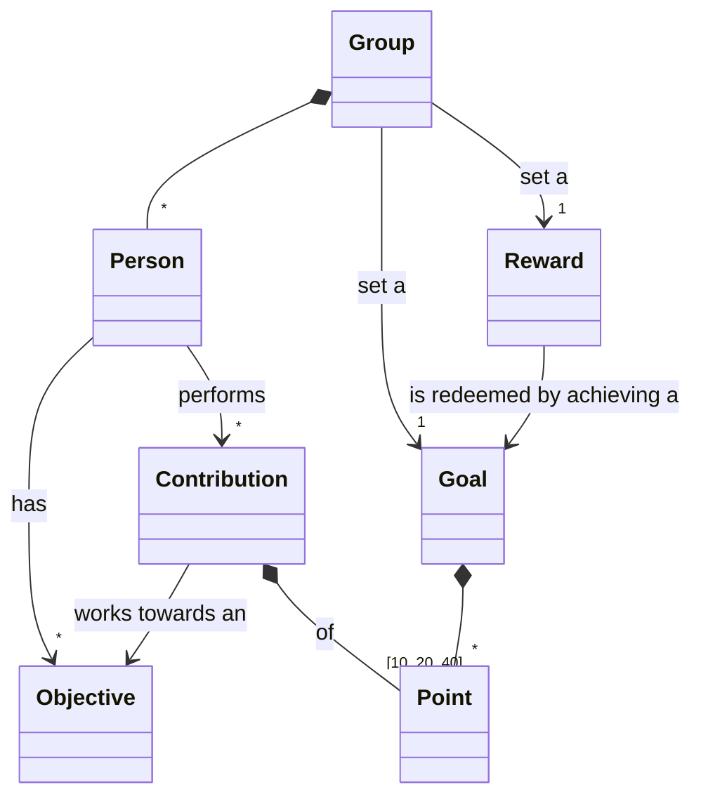

# Points

A simple web app for keeping track of the points achieved on a shared purse for a reward system.

## Domain model

## Exemplary user stories

- A Group set a Goal of Points for a Reward.
- If a Group achieves a Goal, the set Reward is redeemed.
- A Person can set their own Objectives.
- A Person can perform a Contribution of Points.
- A Group can reset the achieved Points. 